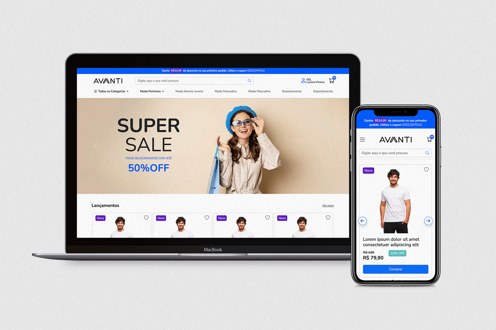

# Teste Técnico Avanti Innovation Class

## Desenvolvimento Layout e-commerce

Projeto realizado em teste técnico para vaga de estágio na Avanti Digital Commerce Expert, no programa Avanti Innovation Class.

## Screenshots

## Resultado

Você pode acessar o resultado clicando [aqui](https://avantiecommerce.netlify.app/).

### Requisitos atendidos

- Desenvolver um layout proposto no Figma utilizando HTML, CSS e JavaScript. [Layout proposto](https://www.figma.com/proto/DqtFxC6312M32mLt8FpJjq/innovation-class?page-id=13%3A673&node-id=13-920&viewport=346%2C140%2C0.11&t=HyGGDSs83f1vbqMJ-1&scaling=scale-down&content-scaling=fixed)
- Aplicar estilos com CSS, garantindo um layout responsivo, (Versão Desktop e Mobile). Para o projeto foi usado o framework Bootstrap.
- Implementar funcionalidade de busca com JavaScript para apenas exibir um alerta com o texto buscado.
- Implementar a interação dos carrrosséis, que foi feito através da biblioteca Slick.

## Stack utilizada

**Front-end:** HTML, CSS, JavaScript, Bootstrap, Slick Carousel

## Autores

- [@rafaverde](https://www.github.com/rafaverde)

## Feedback

Se você tiver algum feedback, por favor me mande um [email](mailto:rafaverde@msn.com).

## Licença

[MIT](https://choosealicense.com/licenses/mit/)
